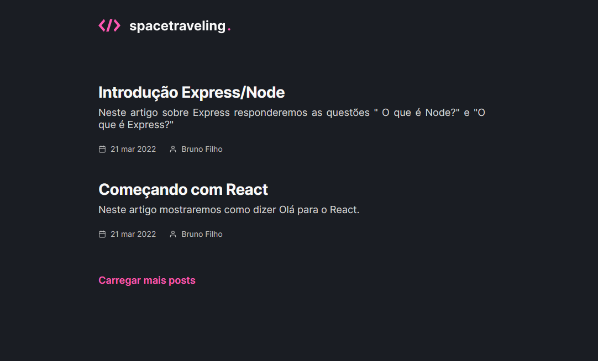
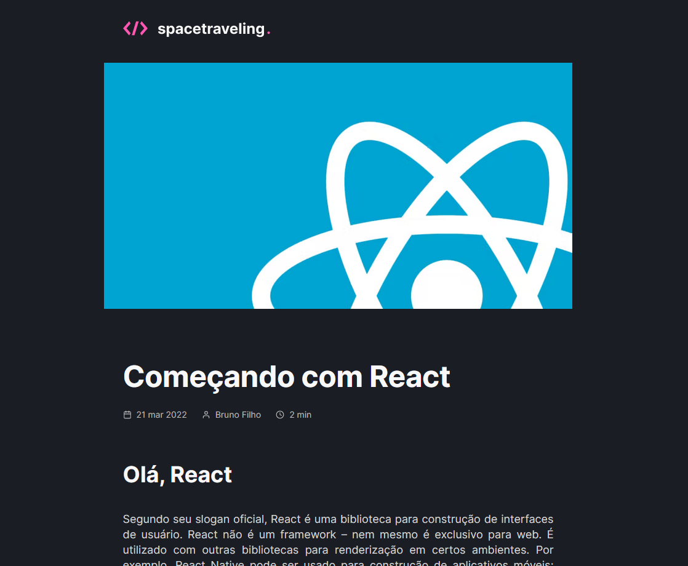

## 💻 Sobre o projeto

Spacetraveling é um blog em Next.js, em que você precisa configurar sua conta do Prismic CMS e começar a criar suas postagens. Feito do zero a partir de um layout do Figma como desafio da trilha de ReactJS do Ignite.

<h1 align="center">
    
</h1>

<br>

## 🧪 Tecnologias usadas

Esse projeto foi desenvolvido com as seguintes tecnologias:

- [React](https://reactjs.org)
- [Next.js](https://nextjs.org/)
- [TypeScript](https://www.typescriptlang.org/)
- [SCSS](https://sass-lang.com/)
- [Prismic](https://prismic.io/)

## 🔗 Clone a aplicação

Clone o projeto e acesse a pasta do mesmo.

```bash
$ git clone https://github.com/brunofilho1/spacetraveling-ignite-reactjs-desafio3
$ cd spacetraveling-ignite-reactjs-desafio3
```

## 🚀 Como iniciar a aplicação

Para iniciá-lo, siga os passos abaixo:

```bash
# Instalando dependências:
$ yarn

# Rodando em modo de desenvolvimento:
$ yarn dev
```

<h1 align="center">
    
</h1>

O app estará disponível no seu browser pelo endereço http://localhost:3000 assim que iniciado.

## 🌐 Live preview

Sem Live Preview
